# Covenant-Additions
Some of our additions and modifications for the open source C2 framework [Covenant](https://github.com/cobbr/Covenant/tree/dev) by @cobbr. These additions are meant to be used with the **dev** branch of Covenant. They have not been tested on the master branch. Tasks have only been tested with .NET 4.0.

## New Tasks
We added some new tasks that have proven to be helpful in our recent work with Covenant. The new tasks are inspired by functionality offered in closed source C2s (mainly [BRc4](https://bruteratel.com/)) and are focused around enumeration of processes and their modules, threads, etc.  
For more information, use `help <task>` in Covenant.

### FindCLRProcess
Enumerate through all running processes to find those that have a CLR loaded.  

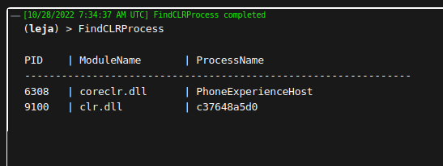

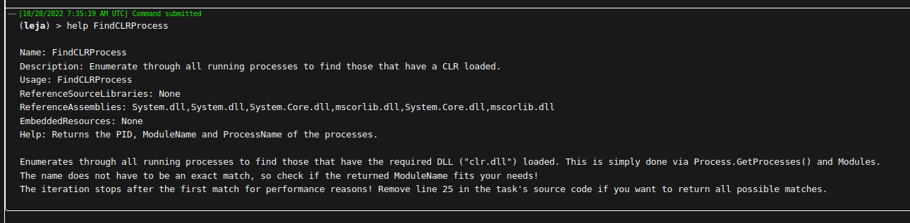

### FindProcessWithDll
Enumerate through all running processes to find those that have the required DLL loaded.

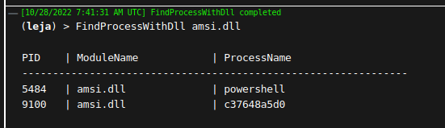

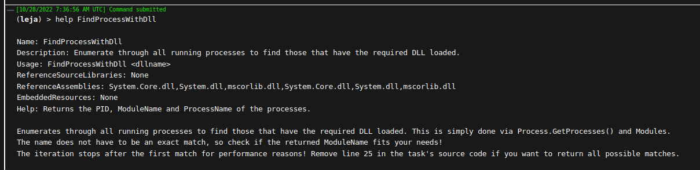

### ListExports
List all the exports of a DLL loaded in the current process.  

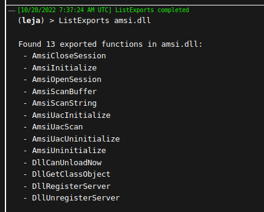

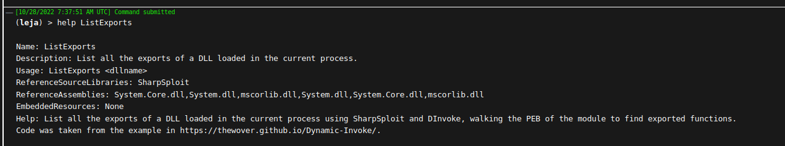

### ListModules
Enumerates the loaded modules of a specified process.  

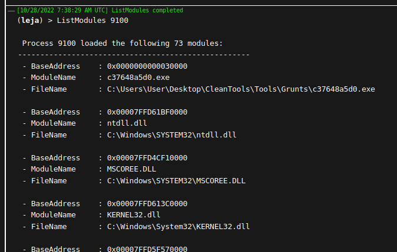

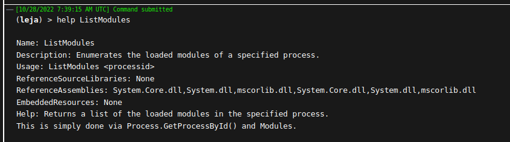

### ListOpenWindows
Lists the titles of all open windows. There are some exceptions when the main window is hidden (such as explorer.exe).  

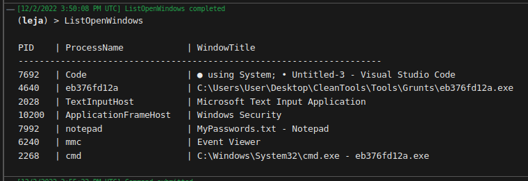

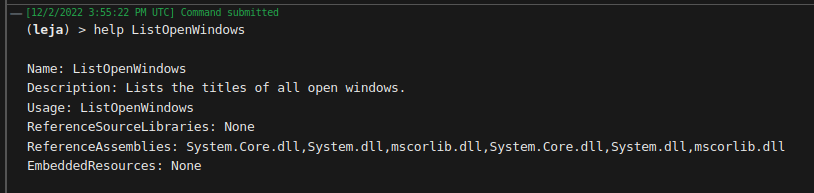

### ListThreads
Enumerates threads and their states in a specified process.  

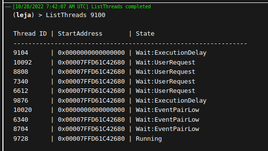

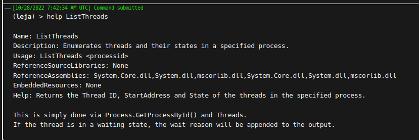

### ProcessWatcher
Continuously watches new process creation events and notifies the operator.  

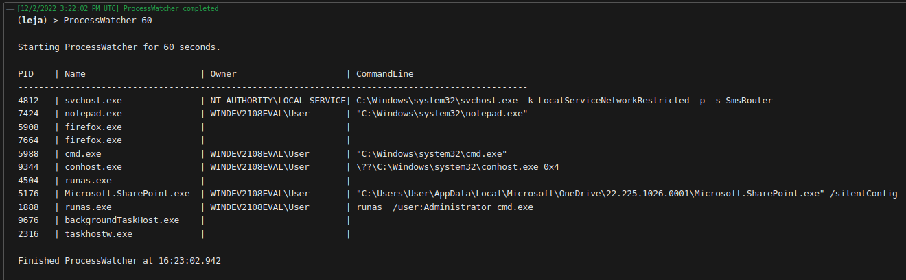

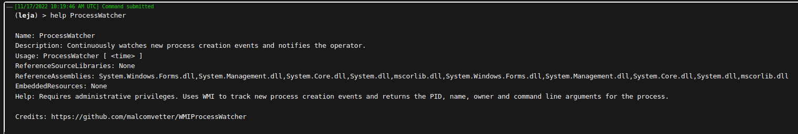

### RunPE
Reflective loader for unmanaged binaries.  

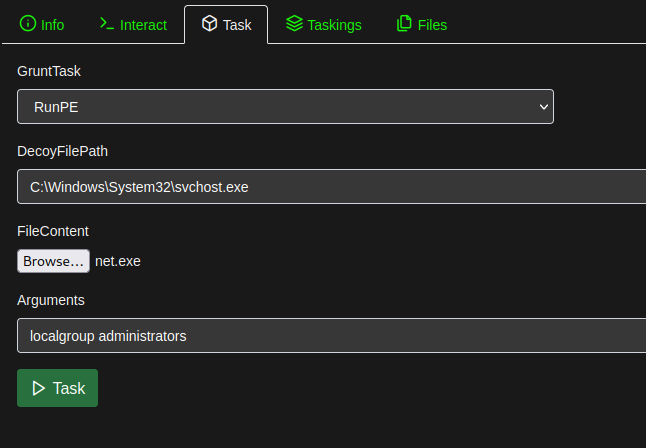

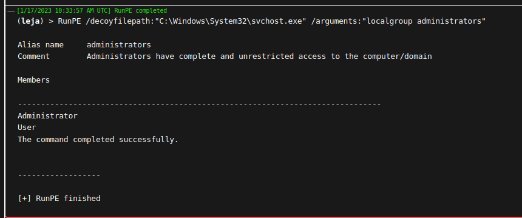

### SecurityWatcher
Continuously watches new security events and notifies the operator.  

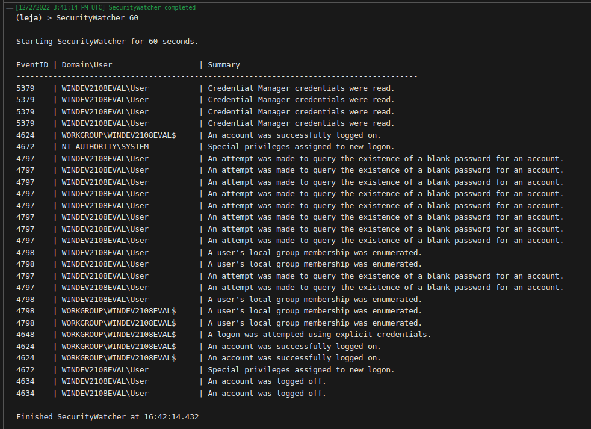

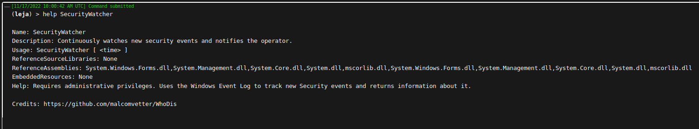

## Modified Tasks
We edited some existing tasks to better suit our needs.  

### Rubeus
Updated the task to allow Rubeus to be upgraded to version 2.2.0 (see this [blog post](https://avantguard.io/en/blog/how-to-update-rubeus-in-covenant) for more information).  
### ProcessList
Now allows filtering the output in a `grep` style with the optional parameter `SearchString`. If the parameter is left empty, the default output (all running processes) will be returned.  

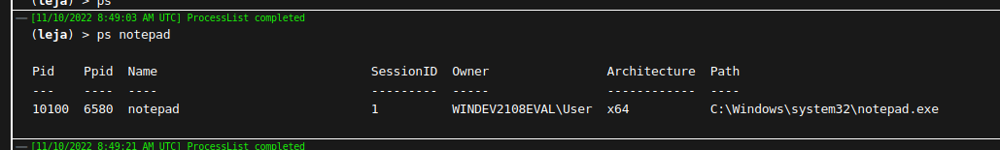

All strings of the output can be matched, so it is also possible to filter for specific PIDs, PPIDs, owners, paths etc. The following screenshot takes the PPID of the previously identified `notepad` process to search for the parent process and its other child processes.

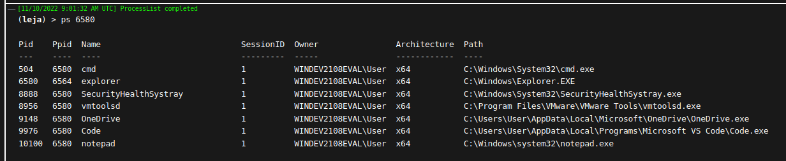
