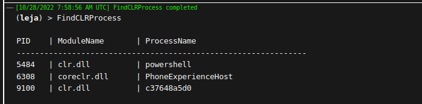

# Covenant-Additions
Some of our additions and modifications for the open source C2 framework [Covenant](https://github.com/cobbr/Covenant/tree/dev) by @cobbr.

## New Tasks
We added some new tasks that have proven to be helpful in our recent work with Covenant. The new tasks are inspired by functionality offered in closed source C2s (mainly [BRc4](https://bruteratel.com/)) and are focused around enumeration of processes and their modules, threads, etc.  
For more information, use `help <task>` in Covenant.

### FindCLRProcess
Enumerate through all running processes to find those that have a CLR loaded.  

### FindProcessWithDll
Enumerate through all running processes to find those that have the required DLL loaded.

### ListExports
List all the exports of a DLL loaded in the current process.  

### ListModules
Enumerates the loaded modules of a specified process.  

### ListThreads
Enumerates threads and their states in a specified process.  

## Modified Tasks
We edited some existing tasks to better suit our needs.  

### Rubeus
Updated the task to allow Rubeus to be upgraded to version 2.2.0 (see this [blog post](https://avantguard.io/en/blog/how-to-update-rubeus-in-covenant) for more information).  
### ProcessList
Will allow to filter the output in a `grep` style. The formatting of the filtered output is still a bit wonky, will be added soon.
